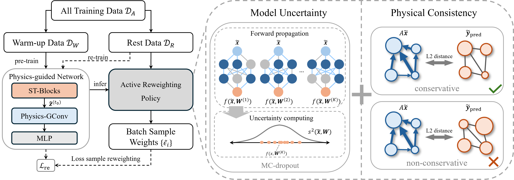

# P-GASR: Physics-guided Active Sample Reweighting for Urban Flow Prediction
This repository is the implementation of CIKM'24 paper: Physics-guided Active Sample Reweighting for Urban Flow Prediction



## Requirements

The proposed method is implemented in Python 3.9 with Pytorch 1.11.0 (Cuda:11.3).

To install requirements:
```setup
pip install -r requirements.txt
```

## Data

Due to size limitations, we only provide NYCBike1, NYCBike2 and NYCTaxi datasets in this repository. For BJTaxi dataset, please download from [Google Drive](https://drive.google.com/file/d/1n0y6X8pWNVwHxtFUuY8WsTYZHwBe9GeS/view?usp=sharing) (provided by the authors of [STSSL](https://github.com/Echo-Ji/ST-SSL))

## Model Training

Run main.py to train the model.

If you want to train the model from scratch, run pretrain.py to pretrain for obtaining sample weights beform run main.py.

Please make sure the enviornment setting is correct for reproducing the result.
